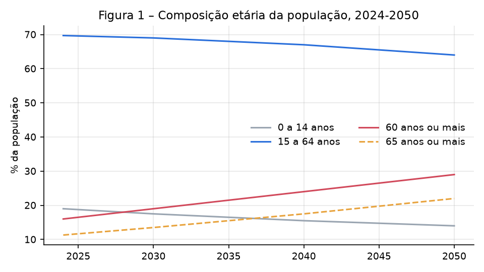
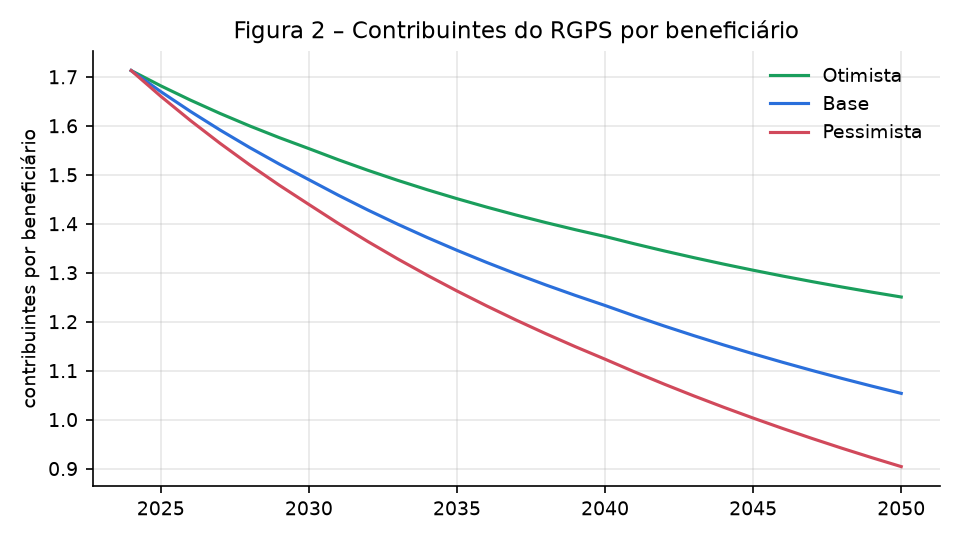
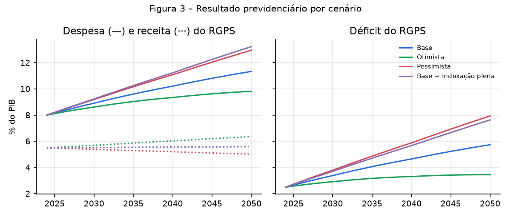
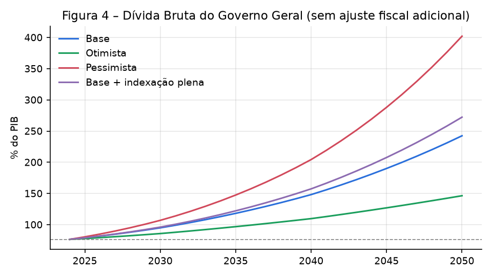

# Envelhecimento populacional, Previdência Social e sustentabilidade da dívida pública brasileira até 2050

**Resumo.** Este artigo investiga como a mudança na estrutura etária da população brasileira pode afetar o resultado do Regime Geral de Previdência Social (RGPS), o gasto público e a trajetória da dívida pública até 2050. Em vez de um modelo econométrico ou de equilíbrio geral, adota-se uma abordagem contábil simples, por cenários, que liga quatro elementos: quantas pessoas estão em idade de trabalhar, quantas contribuem, quantas recebem benefícios e quanto a economia cresce. Os resultados indicam que a relação entre contribuintes e beneficiários do RGPS cai de cerca de 1,7 em 2024 para algo próximo de 1,0 em 2050 no cenário base. Mantidas as regras atuais e sem ajuste fiscal adicional, a despesa do RGPS passa de 8,0% para cerca de 11,3% do PIB, e o déficit previdenciário mais que dobra, de 2,5% para 5,7% do PIB. Como a dívida já parte de um patamar elevado e o juro real supera o crescimento, esse déficit adicional coloca a Dívida Bruta do Governo Geral numa trajetória explosiva. Crescimento da produtividade, aumento da ocupação e formalização do emprego reduzem de forma relevante o problema, mas não o eliminam: mesmo no cenário otimista, seria necessário um esforço fiscal adicional de cerca de 2,3 pontos percentuais do PIB por ano para trazer a dívida de 2050 de volta ao nível de 2024.

**Palavras-chave:** envelhecimento populacional; Previdência Social; RGPS; dívida pública; projeções fiscais; cenários.

**Classificação JEL:** H55; H63; J11.

---

## 1. Introdução

O Brasil está envelhecendo depressa. Países europeus levaram mais de um século para dobrar a proporção de idosos na população; no Brasil, essa transição deve ocorrer em pouco mais de duas décadas. A queda da fecundidade, hoje abaixo do nível de reposição, e o aumento da expectativa de vida fazem com que o número de pessoas com 60 anos ou mais cresça rapidamente, enquanto a população em idade ativa se aproxima do seu ponto máximo e começa a diminuir.

Essa mudança importa para as finanças públicas porque a Previdência Social é, de longe, o maior item de despesa primária do governo federal. O RGPS funciona em regime de repartição: as contribuições de quem trabalha hoje pagam os benefícios de quem está aposentado hoje. Quando a proporção de aposentados cresce mais rápido do que a de contribuintes, o sistema passa a depender cada vez mais de recursos do Tesouro, o que pressiona o resultado primário e, por consequência, a dívida pública.

A pergunta que orienta este trabalho é: **como as mudanças na estrutura etária da população brasileira podem afetar o resultado previdenciário, o gasto público e a trajetória da dívida pública até 2050?**

Para respondê-la, o artigo investiga quatro pontos:

1. a evolução da proporção de idosos e da população em idade ativa;
2. a relação entre contribuintes, beneficiários e arrecadação previdenciária;
3. como diferentes trajetórias de despesas e receitas afetam a necessidade de financiamento do governo;
4. como o crescimento econômico, a produtividade e o emprego formal alteram os resultados.

A contribuição do artigo é principalmente didática e metodológica. Em vez de modelos matemáticos complexos, utiliza-se um conjunto pequeno de relações contábeis, fáceis de reproduzir numa planilha, que permitem ver com clareza *por que* o envelhecimento pressiona as contas públicas e *quais alavancas* podem aliviar essa pressão. Todo o código e as tabelas de resultados acompanham o texto.

Além desta introdução, o artigo tem mais cinco seções. A Seção 2 resume o contexto demográfico e institucional. A Seção 3 descreve o método e os cenários. A Seção 4 apresenta os resultados. A Seção 5 discute implicações de política e limitações, e a Seção 6 conclui.

## 2. Contexto

### 2.1 A transição demográfica brasileira

A transição demográfica é a passagem de um regime de altas taxas de natalidade e mortalidade para outro, com taxas baixas. No Brasil, a taxa de fecundidade caiu de mais de seis filhos por mulher nos anos 1960 para cerca de 1,6 atualmente. Ao mesmo tempo, a expectativa de vida ao nascer superou os 76 anos.

Durante algumas décadas, essa transição gerou um **bônus demográfico**: havia relativamente poucas crianças e poucos idosos para cada pessoa em idade de trabalhar, o que favorece a poupança, o crescimento e as contas públicas. As projeções do IBGE indicam que esse bônus está chegando ao fim. A população total deve atingir seu máximo por volta de 2041 e depois começar a diminuir, enquanto a participação dos idosos continua subindo.

### 2.2 O RGPS e as regras de benefício

O RGPS cobre os trabalhadores do setor privado e é administrado pelo INSS. Em 2024, pagou cerca de 34 milhões de benefícios (aposentadorias, pensões e auxílios), com despesa da ordem de 8% do PIB, enquanto a arrecadação líquida ficou próxima de 5,5% do PIB. O déficit, portanto, foi de aproximadamente 2,5% do PIB.

Três características institucionais são especialmente relevantes para as projeções:

- **Piso igual ao salário mínimo.** Cerca de dois terços dos benefícios equivalem a um salário mínimo. Assim, a política de valorização do mínimo afeta diretamente a despesa previdenciária.
- **Reforma de 2019 (EC 103/2019).** A reforma introduziu idade mínima para aposentadoria (65 anos para homens e 62 para mulheres no RGPS, com regras de transição) e alterou o cálculo dos benefícios. Seu efeito é reduzir, ao longo do tempo, o número de benefícios concedidos por idoso e o valor médio de novos benefícios.
- **Dependência do emprego formal.** A arrecadação vem das contribuições sobre a folha de salários. Trabalhadores informais, em geral, não contribuem, o que torna a formalização do mercado de trabalho uma variável-chave.

### 2.3 A situação da dívida pública

A Dívida Bruta do Governo Geral (DBGG) encerrou 2024 em torno de 76,5% do PIB, nível alto para um país emergente. A dinâmica da dívida depende basicamente de três fatores: o resultado primário do governo, a taxa de juros real paga sobre a dívida e o crescimento real da economia. Quando o juro real supera o crescimento, a dívida tende a subir por si só, a menos que o governo produza superávits primários suficientes. É nesse ponto que a Previdência se conecta à dívida: um déficit previdenciário maior reduz o resultado primário e aumenta a necessidade de financiamento.

## 3. Método

### 3.1 Visão geral

O método combina **análise demográfica** e **projeção fiscal por cenários**, com horizonte de 2024 a 2050 e passo anual. Todas as variáveis fiscais são expressas em proporção do PIB, o que elimina a necessidade de projetar inflação e facilita comparações.

O modelo é composto por quatro relações simples:

| Relação | Em palavras |
|---|---|
| **Contribuintes** | População de 15 a 64 anos × taxa de ocupação × taxa de contribuição (formalização) |
| **Beneficiários** | População de 60 anos ou mais × benefícios por idoso |
| **PIB** | Número de ocupados × produtividade por trabalhador |
| **Dívida** | Dívida do ano anterior, corrigida pelo juro real e dividida pelo crescimento do PIB, menos o resultado primário do ano |

A partir delas:

- a **receita** do RGPS cresce junto com a massa salarial dos contribuintes (número de contribuintes × salário médio);
- a **despesa** do RGPS cresce junto com a massa de benefícios (número de beneficiários × benefício médio);
- o **salário médio** real cresce no mesmo ritmo da produtividade;
- o **benefício médio** real cresce a uma fração da produtividade, chamada aqui de *grau de indexação*. Um grau de 0,5 significa que o benefício médio incorpora metade dos ganhos de produtividade, o que representa, de forma simplificada, a combinação entre benefícios de um salário mínimo (que têm ganhos reais) e benefícios acima do piso (corrigidos só pela inflação).

Uma consequência útil dessa estrutura é que a **receita previdenciária em proporção do PIB só muda se a formalização mudar**: como salários e PIB crescem com a mesma produtividade, e contribuintes e ocupados andam juntos, a razão entre arrecadação e PIB fica estável, a menos que uma parcela maior (ou menor) dos ocupados passe a contribuir. Já a **despesa em proporção do PIB** sobe sempre que o número de beneficiários cresce mais rápido que o número de ocupados, que é justamente o que o envelhecimento provoca.

### 3.2 A dívida e a necessidade de financiamento

O resultado primário total é dividido em duas partes: o resultado previdenciário (receita menos despesa do RGPS) e o resultado do restante do governo. Para isolar o efeito da Previdência, o resultado primário **fora** do RGPS é mantido constante no nível de 2024 (superávit de cerca de 2,1% do PIB, já que o primário total foi de –0,4% e o déficit do RGPS de 2,5%). Assim, qualquer piora no resultado total vem, por construção, da Previdência.

Três indicadores são calculados:

- **Dívida bruta (% do PIB)**, pela regra de acumulação descrita acima;
- **Necessidade de financiamento**, definida aqui como juros reais sobre a dívida mais o déficit primário. É o volume que o governo precisa captar, a cada ano, além da rolagem da dívida existente;
- **Primário que estabiliza a dívida**, isto é, o superávit que manteria a razão dívida/PIB constante naquele ano. Ele é proporcional à dívida e à diferença entre juro real e crescimento.

Por fim, calcula-se o **esforço fiscal necessário**: o ajuste primário permanente, a partir de 2026, que faria a dívida de 2050 voltar ao nível de 2024. Trata-se de uma medida intuitiva do "tamanho do problema" em cada cenário.

### 3.3 Dados e hipóteses do ano-base

A trajetória demográfica é uma versão estilizada das Projeções da População do IBGE (revisão 2024), com valores em anos-âncora (2024, 2030, 2040 e 2050) e interpolação linear entre eles. Os dados fiscais do ano-base são aproximações dos valores divulgados pelo Tesouro Nacional, pelo Ministério da Previdência Social e pelo Banco Central.

**Tabela 1 – Parâmetros do ano-base (2024)**

| Parâmetro | Valor |
|---|---|
| Despesa do RGPS | 8,0% do PIB |
| Receita líquida do RGPS | 5,5% do PIB |
| Resultado primário do setor público | –0,4% do PIB |
| Dívida Bruta do Governo Geral | 76,5% do PIB |
| Ocupados / população de 15 a 64 anos | 69% |
| Ocupados que contribuem para o RGPS | 57% |
| Benefícios do RGPS por pessoa com 60+ | 1,00 |

*Nota:* o indicador "benefícios por idoso" é próximo de um porque inclui pensões por morte, benefícios por incapacidade e aposentadorias concedidas antes dos 60 anos. Ele serve como uma medida agregada de cobertura, não como uma contagem de idosos atendidos.

### 3.4 Cenários

Foram construídos quatro cenários. Todos incorporam uma queda gradual do número de benefícios por idoso (de 1,00 para 0,85 em 2050), refletindo a maturação da idade mínima introduzida pela EC 103/2019.

**Tabela 2 – Hipóteses dos cenários (valores em 2050; transição linear a partir de 2024)**

| Cenário | Produtividade (% a.a.) | Taxa de ocupação | Taxa de contribuição | Grau de indexação dos benefícios | Juro real (% a.a.) |
|---|---|---|---|---|---|
| Base | 1,2 | 70% | 58% | 0,5 | 4,0 |
| Otimista | 2,0 | 73% | 66% | 0,5 | 3,5 |
| Pessimista | 0,5 | 67% | 52% | 0,5 | 5,0 |
| Base + indexação plena | 1,2 | 70% | 58% | 1,0 | 4,0 |

- **Base:** produtividade próxima à média histórica recente, leve aumento da ocupação (maior participação de mulheres e trabalhadores mais velhos) e estabilidade da formalização.
- **Otimista:** reformas microeconômicas elevam a produtividade, a ocupação cresce mais e a formalização avança de modo significativo; o juro real cai com a melhora do ambiente macroeconômico.
- **Pessimista:** produtividade estagnada, queda da ocupação e aumento da informalidade (por exemplo, com a expansão de trabalho por aplicativos sem contribuição), com juro real mais alto.
- **Base + indexação plena:** idêntico ao Base, mas o benefício médio acompanha integralmente os ganhos de produtividade, como ocorreria se todo o ganho real do salário mínimo fosse repassado a uma parcela maior dos benefícios.

## 4. Resultados

### 4.1 Evolução da estrutura etária

A Figura 1 e a Tabela 3 mostram a mudança na composição etária. A participação das pessoas com 60 anos ou mais sobe de 16% em 2024 para cerca de 29% em 2050, e o número absoluto de idosos quase dobra, de 34 para 63 milhões. A população de 15 a 64 anos, por sua vez, atinge o pico por volta de 2030 (cerca de 149 milhões) e cai para aproximadamente 139 milhões em 2050.

A razão de dependência de idosos (pessoas com 65+ para cada 100 pessoas de 15 a 64 anos) passa de 16 para 34. Em outras palavras, se hoje há pouco mais de seis pessoas em idade ativa para cada idoso de 65 anos ou mais, em 2050 haverá menos de três.



**Tabela 3 – Demografia e mercado de trabalho, cenário Base**

| | 2024 | 2030 | 2035 | 2040 | 2045 | 2050 |
|---|---|---|---|---|---|---|
| População (milhões) | 212,6 | 216,5 | 218,4 | 220,2 | 218,6 | 216,9 |
| 15 a 64 anos (milhões) | 148,2 | 149,4 | 148,5 | 147,5 | 143,2 | 138,8 |
| 60 anos ou mais (milhões) | 34,0 | 41,1 | 47,0 | 52,9 | 57,9 | 62,9 |
| 60+ (% da população) | 16,0 | 19,0 | 21,5 | 24,0 | 26,5 | 29,0 |
| 65+ (% da população) | 11,3 | 13,5 | 15,5 | 17,5 | 19,8 | 22,0 |
| Razão de dependência 65+/15-64 (%) | 16,2 | 19,6 | 22,8 | 26,1 | 30,2 | 34,4 |
| Contribuintes do RGPS (milhões) | 58,3 | 59,2 | 59,2 | 59,2 | 57,8 | 56,4 |
| Beneficiários do RGPS (milhões) | 34,0 | 39,7 | 44,0 | 48,0 | 50,9 | 53,5 |
| Contribuintes por beneficiário | 1,71 | 1,49 | 1,35 | 1,23 | 1,13 | 1,05 |

### 4.2 Contribuintes, beneficiários e arrecadação

O número de contribuintes praticamente não cresce até 2040 e depois diminui, acompanhando a população em idade ativa. Já o número de beneficiários aumenta cerca de 57% até 2050, mesmo considerando o efeito da idade mínima. O resultado é uma queda contínua na relação entre contribuintes e beneficiários: de 1,7 em 2024 para cerca de 1,05 em 2050 no cenário base (Figura 2). No cenário pessimista, com mais informalidade, a relação fica abaixo de um, ou seja, haveria mais beneficiários do que contribuintes.



Do lado da receita, o resultado é menos dramático do que se poderia esperar. Como explicado na Seção 3, a arrecadação em proporção do PIB depende essencialmente da formalização. No cenário base, ela fica estável em torno de 5,5%–5,6% do PIB; no otimista, sobe para 6,4%; e no pessimista, cai para 5,0%. **O problema previdenciário brasileiro, portanto, é sobretudo um problema de despesa**, que cresce porque o número de beneficiários aumenta mais rápido do que o número de trabalhadores que sustentam o PIB.

### 4.3 Resultado previdenciário e gasto público

A Figura 3 e a Tabela 4 resumem os resultados fiscais. No cenário base, a despesa do RGPS sobe de 8,0% para 11,3% do PIB em 2050, e o déficit passa de 2,5% para 5,7% do PIB. No pessimista, a despesa chega a quase 13% do PIB e o déficit a 7,9%. No otimista, a despesa ainda sobe, mas de forma mais moderada (9,8% do PIB), e o déficit se estabiliza em torno de 3,5% do PIB a partir da década de 2040.

O cenário de indexação plena mostra a importância da regra de reajuste dos benefícios: com as mesmas hipóteses demográficas e macroeconômicas do base, repassar integralmente os ganhos de produtividade aos benefícios eleva a despesa em 2050 em quase 2 pontos percentuais do PIB (de 11,3% para 13,2%).



*Nota da Figura 3:* nos cenários Base e Base + indexação plena, as linhas de receita se sobrepõem, pois só a regra de reajuste dos benefícios difere entre eles.

**Tabela 4 – Resumo dos cenários em 2050 (% do PIB, exceto quando indicado)**

| Indicador | Base | Otimista | Pessimista | Base + indexação plena |
|---|---|---|---|---|
| Crescimento médio do PIB 2025-2050 (% a.a.) | 1,0 | 2,0 | 0,1 | 1,0 |
| Contribuintes por beneficiário | 1,05 | 1,25 | 0,90 | 1,05 |
| Despesa do RGPS | 11,3 | 9,8 | 13,0 | 13,2 |
| Receita do RGPS | 5,6 | 6,4 | 5,0 | 5,6 |
| Déficit do RGPS | 5,7 | 3,5 | 7,9 | 7,6 |
| Resultado primário total | –3,6 | –1,4 | –5,8 | –5,5 |
| Necessidade de financiamento | 12,8 | 6,3 | 24,7 | 15,8 |
| Dívida bruta | 242 | 146 | 402 | 272 |
| Esforço fiscal para dívida de 2050 = 2024 (p.p. do PIB por ano) | 4,5 | 2,3 | 6,8 | 5,3 |

Vale notar que o crescimento do PIB projetado é baixo mesmo no cenário base (cerca de 1% ao ano). Isso ocorre porque a força de trabalho deixa de crescer: sem aumento no número de trabalhadores, todo o crescimento precisa vir da produtividade. Esse é outro canal, menos discutido, pelo qual o envelhecimento afeta as contas públicas: ele reduz o crescimento do denominador da razão dívida/PIB.

### 4.4 Trajetória da dívida e necessidade de financiamento

A Figura 4 mostra a trajetória da dívida bruta quando nenhum ajuste fiscal adicional é feito. Em todos os cenários, a dívida sobe continuamente. No base, ela ultrapassa 100% do PIB no início da década de 2030 e chega a cerca de 240% em 2050; no pessimista, supera 400%.

Esses números **não devem ser lidos como previsões**. Muito antes de alcançar tais níveis, o governo seria forçado a ajustar suas contas, ou o mercado passaria a exigir juros ainda mais altos. O objetivo do exercício é mostrar que, com as regras atuais e o resultado primário fora da Previdência congelado, a trajetória é insustentável. A pergunta relevante, portanto, é qual o tamanho do ajuste necessário.



A última linha da Tabela 4 responde a essa pergunta. Para que a dívida de 2050 volte ao nível de 2024 (76,5% do PIB), seria necessário um ajuste primário permanente, a partir de 2026, de 4,5 pontos percentuais do PIB por ano no cenário base, de 2,3 no otimista e de 6,8 no pessimista. Para comparação, os maiores superávits primários do setor público, alcançados no início dos anos 2000, ficaram na faixa de 3% a 4% do PIB.

A necessidade de financiamento segue a mesma lógica. No cenário base, ela passa de cerca de 5% do PIB no fim desta década para quase 13% em 2050, porque ao déficit primário crescente somam-se juros sobre um estoque de dívida cada vez maior. Esse efeito "bola de neve" explica por que as trajetórias se afastam cada vez mais rapidamente ao longo do tempo.

### 4.5 O papel do crescimento, da produtividade e do emprego formal

Para entender quais fatores mais importam, cada hipótese do cenário base foi alterada isoladamente, mantendo as demais constantes (Tabela 5).

**Tabela 5 – Sensibilidade dos resultados de 2050 (variação de uma hipótese por vez em relação ao Base)**

| Hipótese alterada | Déficit do RGPS (% PIB) | Dívida (% PIB) | Diferença em relação ao Base (p.p.) |
|---|---|---|---|
| Base | 5,7 | 242 | 0 |
| Produtividade de 2,0% a.a. | 4,6 | 189 | –53 |
| Produtividade de 0,5% a.a. | 6,8 | 299 | +57 |
| Formalização de 66% em 2050 | 5,0 | 229 | –14 |
| Formalização de 52% em 2050 | 6,3 | 253 | +10 |
| Ocupação de 73% em 2050 | 5,3 | 227 | –16 |
| Ocupação de 67% em 2050 | 6,3 | 260 | +17 |
| Juro real de 3,0% | 5,7 | 198 | –44 |
| Juro real de 5,0% | 5,7 | 297 | +55 |
| Benefício sem ganho real | 4,1 | 215 | –27 |
| Benefício acompanha integralmente o salário | 7,6 | 272 | +30 |
| Sem efeito da EC 103/2019 | 7,7 | 273 | +31 |
| Sem envelhecimento (estrutura etária de 2024) | 0,2 | 123 | –120 |

Algumas lições se destacam:

1. **O envelhecimento é o principal fator.** Se a estrutura etária permanecesse como em 2024, o déficit do RGPS praticamente desapareceria até 2050 (graças à idade mínima e ao crescimento da produtividade) e a dívida terminaria o período cerca de 120 pontos percentuais abaixo do cenário base. Ou seja, dos cerca de 166 pontos percentuais de alta da dívida projetados no cenário base, aproximadamente 120 (algo como 70%) podem ser atribuídos diretamente à mudança demográfica. O restante decorre do fato de o juro real ser maior do que o crescimento, um problema que existe independentemente da Previdência.

2. **A produtividade é a alavanca econômica mais poderosa.** Elevar o crescimento da produtividade de 1,2% para 2,0% ao ano reduz a dívida de 2050 em mais de 50 pontos percentuais. Isso ocorre por dois canais: o PIB cresce mais rápido (o que reduz o peso da dívida) e, como os benefícios não acompanham integralmente os salários, a despesa previdenciária cresce menos do que a economia.

3. **O emprego formal ajuda, mas tem efeito limitado sozinho.** Aumentar a formalização em oito pontos percentuais reduz o déficit do RGPS em cerca de 0,8 ponto do PIB. É um efeito relevante, mas insuficiente para compensar o envelhecimento. A ocupação tem efeito semelhante, somando os ganhos de receita e de PIB.

4. **As regras de benefício importam muito.** A reforma de 2019 já tem efeito considerável: sem ela, o déficit do RGPS em 2050 seria 2 pontos do PIB maior. Da mesma forma, a regra de reajuste dos benefícios (em especial a vinculação ao salário mínimo) pode acrescentar ou retirar cerca de 1,5 a 2 pontos do PIB de despesa em 2050.

5. **O juro real é decisivo para a dívida, embora não para a Previdência.** Uma diferença de um ponto percentual no juro real altera a dívida de 2050 em cerca de 50 pontos percentuais. Credibilidade fiscal e juros mais baixos, portanto, reforçam-se mutuamente.

## 5. Discussão

### 5.1 Implicações para a política pública

Os resultados sugerem que não há uma solução única. A combinação de envelhecimento rápido, dívida elevada e juros altos exige atuação em várias frentes:

- **Crescimento e produtividade.** Políticas que elevem a produtividade (educação, infraestrutura, ambiente de negócios, abertura comercial) têm efeito fiscal expressivo e são, provavelmente, a alavanca mais importante no longo prazo.
- **Mercado de trabalho.** Estimular a participação de mulheres e de trabalhadores mais velhos, e reduzir a informalidade, amplia a base de contribuintes. Modelos de contribuição simplificada para trabalhadores por conta própria e por plataformas digitais são particularmente relevantes.
- **Regras previdenciárias.** A idade mínima deverá ser periodicamente revista à medida que a expectativa de vida aumentar. A regra de reajuste do piso previdenciário, hoje ligada ao salário mínimo, é uma escolha com grande impacto fiscal e distributivo, que merece debate explícito.
- **Política fiscal geral.** Como a dívida já é alta e o juro real supera o crescimento, parte relevante do ajuste terá de vir de fora da Previdência, seja por meio de receitas, seja pela contenção de outras despesas.

### 5.2 Limitações

Por ser deliberadamente simples, o modelo tem limitações importantes:

- **Demografia estilizada.** As projeções usam valores aproximados e interpolação linear entre anos-âncora, não a série anual por idade e sexo do IBGE. Para uso aplicado, recomenda-se substituir esses valores pelas séries oficiais mais recentes.
- **Ausência de efeitos de retroalimentação.** O modelo não considera que uma dívida crescente eleve os juros, nem que a taxa de juros e o crescimento dependam da política fiscal. Na prática, esses efeitos tornariam os cenários ruins ainda piores.
- **Benefícios agregados.** Não se distinguem aposentadorias urbanas e rurais, pensões e benefícios por incapacidade, nem o estoque de benefícios antigos e novos concedidos sob as regras da EC 103/2019.
- **Escopo restrito ao RGPS.** Os regimes próprios de servidores (RPPS) da União, dos estados e dos municípios, bem como o Benefício de Prestação Continuada (BPC), também serão afetados pelo envelhecimento, assim como os gastos com saúde. Incluí-los aumentaria a pressão fiscal estimada.
- **Hipóteses constantes.** O resultado primário fora da Previdência é mantido fixo para isolar o efeito previdenciário, o que não corresponde a uma previsão de política fiscal.

Apesar dessas limitações, o sentido dos resultados é robusto: em nenhuma combinação razoável de hipóteses o envelhecimento deixa de pressionar significativamente as contas públicas.

## 6. Conclusão

O Brasil caminha para uma estrutura etária muito mais envelhecida até 2050, com quase o dobro de idosos e uma população em idade ativa menor que a atual. Este artigo mostrou, com um modelo contábil simples, como essa mudança se traduz em pressão fiscal.

Em resposta à pergunta de pesquisa: a mudança na estrutura etária tende a reduzir a relação entre contribuintes e beneficiários do RGPS de 1,7 para cerca de 1,0, a elevar a despesa previdenciária entre 2 e 5 pontos percentuais do PIB, conforme o cenário, e a mais que dobrar o déficit do sistema no cenário base. Na ausência de ajuste, isso colocaria a dívida pública numa trajetória insustentável. O envelhecimento responde, sozinho, por cerca de 70% da alta da dívida projetada no cenário base.

O crescimento da produtividade, a ampliação do emprego e a formalização atenuam significativamente esse quadro, mas não o eliminam. Mesmo no cenário otimista, seria necessário um esforço fiscal adicional de mais de 2 pontos do PIB por ano para manter a dívida no nível atual. A mensagem principal, portanto, é que o envelhecimento é um desafio previsível e de grande magnitude, que precisa ser enfrentado de forma combinada: com políticas de crescimento, de mercado de trabalho, de revisão periódica das regras previdenciárias e de responsabilidade fiscal. Quanto mais cedo esse ajuste começar, menor será o esforço necessário.

## Referências

BANCO CENTRAL DO BRASIL. *Estatísticas fiscais*. Brasília: BCB, 2025.

BRASIL. Emenda Constitucional nº 103, de 12 de novembro de 2019. Altera o sistema de previdência social e estabelece regras de transição e disposições transitórias.

BRASIL. Ministério da Previdência Social. *Boletim Estatístico da Previdência Social*. Brasília, 2025.

BRASIL. Tesouro Nacional. *Resultado do Tesouro Nacional*. Brasília, 2025.

CAMARANO, A. A. (Org.). *Novo regime demográfico: uma nova relação entre população e desenvolvimento?* Rio de Janeiro: Ipea, 2014.

GIAMBIAGI, F.; TAFNER, P. *Demografia: a ameaça invisível*. Rio de Janeiro: Elsevier, 2010.

IBGE – INSTITUTO BRASILEIRO DE GEOGRAFIA E ESTATÍSTICA. *Projeções da população do Brasil e das Unidades da Federação: 2000-2070* (revisão 2024). Rio de Janeiro: IBGE, 2024.

IBGE – INSTITUTO BRASILEIRO DE GEOGRAFIA E ESTATÍSTICA. *Pesquisa Nacional por Amostra de Domicílios Contínua*. Rio de Janeiro: IBGE, 2025.

INSTITUIÇÃO FISCAL INDEPENDENTE. *Relatório de Acompanhamento Fiscal*. Brasília: Senado Federal, 2025.

LEE, R.; MASON, A. (Eds.). *Population aging and the generational economy: a global perspective*. Cheltenham: Edward Elgar, 2011.

UNITED NATIONS. *World Population Prospects 2024*. New York: UN DESA, 2024.

---

## Apêndice – Reprodutibilidade

Todos os resultados deste artigo podem ser reproduzidos com o script `codigo/projecoes.py` (Python 3, com `pandas` e `matplotlib`):

```bash
pip install pandas matplotlib
cd codigo
python3 projecoes.py
```

O script gera:

- `resultados/demografia.csv`: trajetória demográfica anual;
- `resultados/cenario_*.csv`: trajetórias anuais de cada cenário;
- `resultados/resumo_cenarios.csv`: Tabela 4;
- `resultados/sensibilidade.csv`: Tabela 5;
- `resultados/tabela_demografia_trabalho.csv`: Tabela 3;
- `figuras/*.png`: Figuras 1 a 4.

Os parâmetros do ano-base e dos cenários ficam concentrados no início do script (`ANCORAS_DEMO`, `ANO_BASE` e `CENARIOS`), o que permite substituí-los facilmente por dados oficiais atualizados ou testar novas hipóteses.
