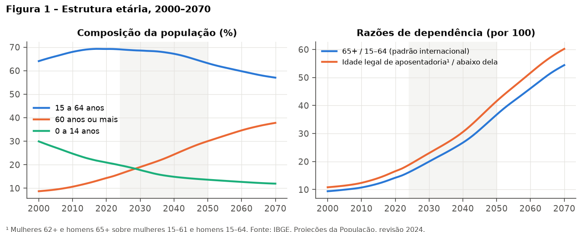
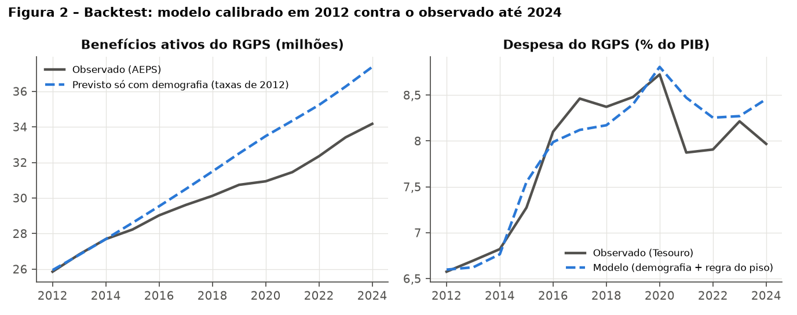
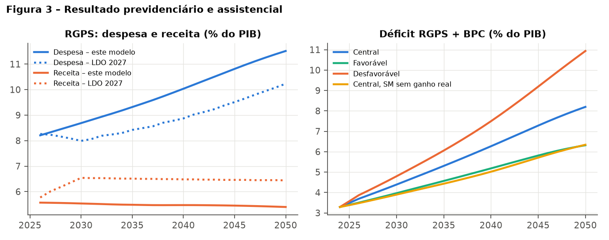
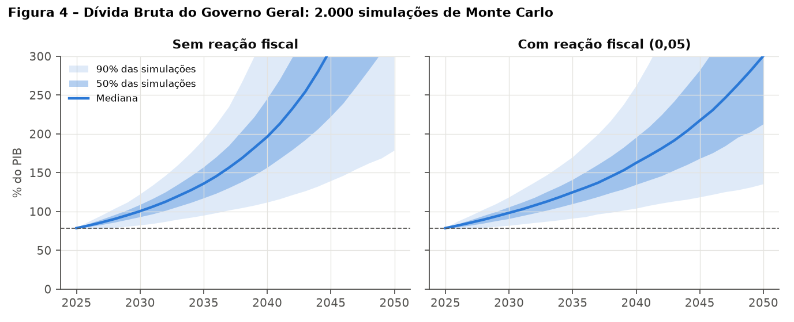
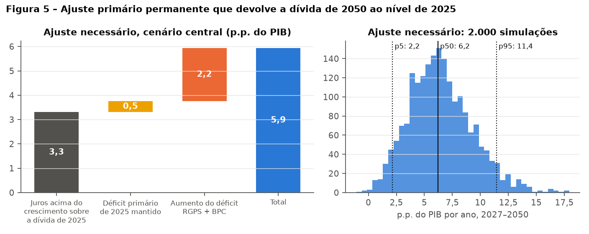
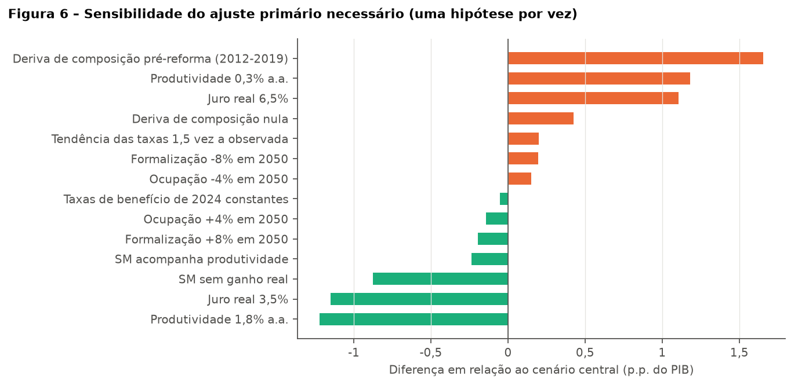

# Envelhecimento populacional, RGPS e BPC: efeitos sobre o resultado primário e a dívida pública brasileira até 2050

**Resumo.** Este artigo investiga como a mudança na estrutura etária da população brasileira pode afetar o resultado do Regime Geral de Previdência Social (RGPS) e do Benefício de Prestação Continuada (BPC), o resultado primário e a trajetória da Dívida Bruta do Governo Geral (DBGG) até 2050. O método é contábil e deliberadamente simples: o número de contribuintes, beneficiários e ocupados em cada ano é obtido multiplicando taxas por sexo e idade, medidas nos dados administrativos da Previdência (AEPS 2024) e na PNAD Contínua, pela população projetada pelo IBGE (revisão 2024). Os parâmetros que mais movem os resultados são estimados com dados: o grau de indexação dos benefícios ao salário mínimo (0,41, a parcela do valor pago a quem recebe um piso), a deriva de composição do benefício médio antes e depois da Emenda Constitucional 103/2019 (+0,9% e −0,3% ao ano) e a tendência das taxas por idade entre 2012 e 2024. O modelo é testado retroativamente: calibrado em 2012, ele reproduz a despesa do RGPS de 2013 a 2024 com erro médio absoluto de 0,23 ponto percentual (p.p.) do PIB. Projetado a partir de 2024, erra 2025 em 0,05 p.p. No cenário central, a relação entre contribuintes e beneficiários do RGPS cai de 1,8 em 2025 para 1,0 em 2050, e o déficit conjunto do RGPS e do BPC passa de 3,5% para 8,2% do PIB. A incerteza sobre juros, crescimento e parâmetros é tratada por 2.000 simulações de Monte Carlo. Se nada for feito, em 92% delas a dívida bruta passa de 100% do PIB em 2035. Em vez de reportar níveis de dívida sem sentido econômico para 2050, o artigo calcula o ajuste primário permanente, a partir de 2027, que devolveria a dívida de 2050 ao nível de 2025: 5,9 p.p. do PIB no cenário central, com mediana de 6,2 p.p. e intervalo de 90% entre 2,2 e 11,4 p.p. nas simulações. Uma decomposição exata atribui 3,3 p.p. desse ajuste aos juros acima do crescimento sobre a dívida já existente, 0,5 p.p. ao déficit primário atual e 2,2 p.p. ao aumento do déficit do RGPS e do BPC. Uma decomposição de Shapley atribui 2,7 p.p. ao envelhecimento, incluindo seu efeito sobre o crescimento do PIB, e 0,7 p.p. ao ganho real do salário mínimo. Produtividade e juro real são as hipóteses que mais alteram o resultado; formalização e taxa de ocupação importam menos do que se costuma supor.

**Palavras-chave:** envelhecimento populacional; Previdência Social; RGPS; BPC; sustentabilidade da dívida; Monte Carlo.

**Classificação JEL:** H55; H63; H68; J11.

---

## 1. Introdução

O Brasil envelhece depressa. Segundo as Projeções da População do IBGE (revisão 2024), a parcela de pessoas com 60 anos ou mais passa de 16,6% em 2025 para 30,0% em 2050, e o número de idosos quase dobra, de 35,4 para 65,6 milhões. A população de 15 a 64 anos atinge seu máximo por volta de 2035 (149,6 milhões) e cai para 138,0 milhões em 2050. Como o RGPS funciona em repartição, com as contribuições de quem trabalha pagando os benefícios de quem se aposentou, essa mudança pressiona diretamente o resultado primário e, por meio dele, a dívida pública.

A pergunta de pesquisa é: **como as mudanças na estrutura etária da população brasileira podem afetar o resultado previdenciário, o gasto público e a trajetória da dívida pública até 2050?** Ela se desdobra em quatro questões:

1. como evoluem a proporção de idosos e a população em idade ativa;
2. como evoluem os contribuintes, os beneficiários e a arrecadação previdenciária;
3. como diferentes trajetórias de despesa e receita afetam a necessidade de financiamento do governo;
4. quanto o crescimento, a produtividade e o emprego formal alteram os resultados.

O artigo busca responder a essas perguntas com um instrumento que qualquer leitor possa reproduzir numa planilha, mas sem abrir mão de disciplina empírica. Quatro escolhas guiam o trabalho:

- **Dados oficiais em nível de detalhe.** Usam-se a série anual por sexo e idade simples do IBGE e as tabelas do Anuário Estatístico da Previdência Social (AEPS) com benefícios e contribuintes por sexo e grupo de idade, em vez de trajetórias estilizadas.
- **Parâmetros calibrados, não arbitrados.** O grau de indexação dos benefícios, a deriva do benefício médio e a tendência das taxas por idade são medidos nos dados, e o efeito da EC 103/2019 aparece como estimativa (a mudança da deriva antes e depois de 2019), não como premissa.
- **Validação.** O modelo é testado retroativamente (2012–2024) e fora da amostra (2025), e seus resultados são comparados às projeções da LDO 2027 e da Instituição Fiscal Independente (IFI).
- **Incerteza explícita.** A dívida é projetada por Monte Carlo, com juros e crescimento aleatórios, prêmio de risco dependente da dívida e uma variante com reação fiscal. O resultado principal é o ajuste primário necessário, e não um nível de dívida em 2050, que sem reação da política deixa de ter significado econômico.

O escopo fiscal é o RGPS e o BPC, que em 2025 somaram 9,1% do PIB de despesa. Os regimes próprios dos servidores (RPPS) e a saúde ficam fora do modelo; a Seção 6 discute o que isso implica.

## 2. Literatura

**Sustentabilidade da dívida.** A literatura oferece dois critérios complementares. O primeiro é contábil: a dívida em proporção do PIB se estabiliza quando o superávit primário iguala a dívida multiplicada pela diferença entre juro real e crescimento real. Daí vem a noção de "hiato" ou ajuste necessário para atingir uma meta de dívida em certo horizonte (Blanchard *et al.*, 1990), usada neste artigo. O segundo é comportamental: Bohn (1998) mostra que a dívida é sustentável se o resultado primário responde positivamente ao nível da dívida. Essa "função de reação" foi estimada para painéis de países (Mendoza e Ostry, 2008), com limites de "fadiga fiscal" a partir de certos níveis de endividamento (Ghosh *et al.*, 2013), e para o Brasil (Mello, 2008). Blanchard (2019) lembra que, quando o juro real é menor que o crescimento (r < g), dívidas elevadas podem ter custo fiscal baixo. No Brasil ocorre o oposto: de 2007 a 2025 o custo real implícito da Dívida Pública Federal foi, em média, 5,1% ao ano, e o PIB cresceu 2,0% ao ano. Laubach (2009) estima que cada ponto percentual de dívida/PIB eleva os juros de longo prazo em cerca de 3 a 4 pontos-base, efeito usado aqui para calibrar o prêmio de risco. Celasun, Debrun e Ostry (2006) propõem os gráficos em leque (*fan charts*) estocásticos para avaliar riscos de sustentabilidade em economias emergentes, abordagem seguida na Seção 5.5.

**Envelhecimento, crescimento e contas públicas.** O envelhecimento afeta as contas públicas por dois canais. O primeiro, direto, é o aumento do número de beneficiários relativamente ao de contribuintes. O segundo, menos lembrado, é o efeito sobre o crescimento: menos pessoas em idade ativa significam menos trabalho e, possivelmente, menor produtividade (Bloom, Canning e Fink, 2010; Maestas, Mullen e Powell, 2023). Lee e Mason (2011) oferecem o arcabouço das contas nacionais de transferência que fundamenta a ideia de medir perfis etários de consumo, renda e transferências. No Brasil, Giambiagi e Tafner (2010) e Camarano (2014) documentam a velocidade da transição demográfica e suas consequências previdenciárias.

**Projeções oficiais.** A avaliação atuarial do RGPS que acompanha o Projeto de Lei de Diretrizes Orçamentárias de 2027 (PLDO 2027, Anexo IV.10) projeta despesa de 10,2% do PIB em 2050, receita de 6,4% e necessidade de financiamento de 3,8%. A IFI (RAF nº 112, maio de 2026) projeta despesa de 9,1% do PIB em 2030 e receita de 5,5% do PIB em 2030, 0,6 p.p. abaixo da estimativa do Executivo. Este artigo não pretende substituir modelos atuariais completos, que acompanham coortes de segurados e regras de cálculo de cada benefício. O objetivo é oferecer uma aproximação transparente, validada contra os dados e contra essas projeções, e que liga explicitamente a Previdência à dívida.

## 3. Dados

Todas as séries vêm de fontes oficiais públicas. A Tabela 1 resume o uso de cada uma; os scripts de download e preparação estão no apêndice.

**Tabela 1 – Fontes de dados**

| Informação | Fonte | Detalhe |
|---|---|---|
| População por sexo e idade simples, 2000–2070 | IBGE, Projeções da População, revisão 2024 | Tabela 1 (idade simples), Brasil |
| Benefícios ativos por sexo e grupo de idade (RGPS sem pensões, BPC idoso, BPC deficiência), dez. 2010–2012 e 2022–2024 | AEPS 2012 e AEPS 2024 | Tabelas C.5, 19.2 e 19.3 |
| Pensões por morte por sexo e idade do dependente | AEPS 2012 e 2024 | Tabelas 15.2 e 15.4 |
| Contribuintes (número médio mensal) por sexo e idade | AEPS 2012 e 2024 | Tabela 32.3 |
| Benefícios ativos e valor, dez. 2011–2024 | AEPS, suplemento histórico 2023 e AEPS 2024 | Tabelas 1.25, 1.26, C.1 e C.2 |
| Valor pago a quem recebe exatamente um piso | AEPS 2012 e 2024 | Tabela B.23 |
| Receita e despesa do RGPS, despesa do BPC, % do PIB, 1997–2025 | Tesouro Nacional, Resultado do Tesouro Nacional | Tabela 2.1-A |
| DBGG, resultado primário e nominal do setor público, PIB | BCB, SGS | Séries 13762, 5793, 5727, 4382 |
| IPCA, crescimento real do PIB, salário mínimo | BCB, SGS | Séries 433, 7326, 1619 |
| Juros apropriados e estoque da Dívida Pública Federal | Tesouro Nacional | Fatores de variação da DPF |
| Ocupação e informalidade por grupo de idade, 2012–2025 | IBGE, PNAD Contínua | SIDRA, tabela 4094 |
| Projeções oficiais | PLDO 2027, Anexos IV.10 (RGPS) e IV.11 (RPPS da União); IFI, RAF nº 112 | — |

Três números de 2024 servem de ponto de partida e de verificação:

- **Benefícios.** Em dezembro de 2024, o INSS mantinha 40,6 milhões de benefícios ativos. Desses, **34,2 milhões eram do RGPS** (23,4 milhões de aposentadorias, 8,4 milhões de pensões e 2,4 milhões de auxílios e outros) e 6,4 milhões eram assistenciais (BPC e RMV). A população com 60 anos ou mais era de 34,2 milhões. A coincidência é apenas aparente: 20% dos benefícios do RGPS (6,9 milhões, pelas Tabelas C.5, 15.2, 15.4 e 19.2 do AEPS) são pagos a pessoas com menos de 60 anos, como pensionistas jovens, aposentados por incapacidade e aposentados precoces por tempo de contribuição; e há idosos sem benefício e idosos que acumulam dois (por exemplo, aposentadoria e pensão). Por isso, o modelo não usa um corte etário único: trabalha com o perfil completo por sexo e idade (Seção 4.1).
- **Contribuintes.** Em média, 62,2 milhões de pessoas contribuíram por mês para o RGPS em 2024.
- **Contas.** Em 2025, a despesa do RGPS foi de 8,06% do PIB, a receita de 5,57% e a despesa com BPC e RMV de 1,00%. A DBGG terminou 2025 em 78,6% do PIB, e o setor público teve déficit primário de 0,43% do PIB.

## 4. Método

### 4.1 A regra única: taxa por idade × população por idade

Todas as quantidades de pessoas saem de uma só regra:

> **número de pessoas numa situação = taxa por sexo e idade × população daquele sexo e idade**

A regra é aplicada a cinco situações: receber benefício do RGPS (exceto pensão), receber pensão por morte, receber BPC, contribuir para o RGPS e estar ocupado. As quatro primeiras taxas são calculadas com o AEPS; a ocupação, com a PNAD. Por exemplo, em 2024, 59,6% das mulheres de 65 a 69 anos recebiam algum benefício do RGPS que não pensão, e 45,2% das mulheres de 25 a 29 anos contribuíam para o RGPS. Multiplicando cada taxa pela população projetada do mesmo sexo e grupo de idade e somando, obtém-se o total de beneficiários ou contribuintes em cada ano.

Essa regra resolve a mistura de cortes etários que um indicador simples introduz. O texto usa três cortes, cada um com uma função:

- **60 anos ou mais** para descrever o envelhecimento, por ser a definição legal de pessoa idosa no Brasil;
- **65+ sobre 15–64 anos** como razão de dependência, por ser o padrão internacional comparável;
- **idade mínima de aposentadoria da EC 103/2019** (62 anos para mulheres, 65 para homens) para uma razão de dependência "legal".

O modelo, porém, não depende de nenhum desses cortes: usa todas as idades.

### 4.2 Da contagem de pessoas às contas em % do PIB

Com as quantidades em mãos, as contas são expressas em proporção do PIB, sempre a partir do valor observado no ano-base:

- **PIB real** = ocupados × produtividade do trabalho.
- **Despesa do RGPS** cresce com o número de benefícios (pensões e demais, ponderados pelo seu peso no valor pago) e com o benefício médio real, e cai com o PIB.
- **Receita do RGPS** cresce com o número de contribuintes e com o salário real, e cai com o PIB. Supõe-se que o salário médio real acompanha a produtividade.
- **Despesa com BPC** cresce com o número de beneficiários e com o salário mínimo real (o BPC vale um salário mínimo), e cai com o PIB.

Uma consequência importante, e uma **hipótese, não um achado**, é que a receita em proporção do PIB só muda por dois motivos: porque a razão entre contribuintes e ocupados muda (as duas taxas têm perfis etários diferentes, e o envelhecimento desloca pessoas para idades em que se contribui menos) ou porque a formalização muda. Se a participação dos salários no PIB mudasse, a receita mudaria também, mas o modelo não trata disso. A Seção 6 volta ao ponto.

### 4.3 Como cada parâmetro foi calibrado

**Grau de indexação ao salário mínimo (φ = 0,41).** Benefícios de um piso são reajustados pelo salário mínimo; os demais, pela inflação. O benefício médio, portanto, recebe uma fração dos ganhos reais do mínimo igual à parcela do valor pago a quem recebe exatamente um piso. Pela Tabela B.23 do AEPS, retirados os assistenciais, essa parcela foi de 0,40 a 0,42 entre 2011 e 2024. Usa-se a média, 0,41.

**Deriva de composição do benefício médio (α).** Além do piso, o benefício médio muda porque os benefícios que entram têm valor diferente dos que saem. Essa deriva é medida como a parte do crescimento real do benefício médio do RGPS que não se explica pelo salário mínimo. Entre 2012 e 2019 ela foi de **+0,89% ao ano**; entre 2019 e 2024, após a EC 103/2019, que reduziu o valor dos benefícios novos, foi de **−0,34% ao ano**. A mesma mudança aparece quando o benefício médio é calculado com a despesa do Tesouro (+1,1% e −0,3% ao ano). O cenário central usa o valor pós-reforma. É assim que o efeito da reforma entra no modelo: como estimativa, e não como premissa.

**Tendência das taxas por idade.** Entre 2012 e 2024, as taxas de benefício caíram nas idades de 45 a 64 anos (efeito das idades mínimas e da reforma de 2015 nas pensões) e subiram levemente acima de 65 anos. As pensões femininas caíram de 2% a 3% ao ano em quase todas as idades adultas. O cenário central prolonga essas variações por sexo e idade, com intensidade que diminui linearmente até zero em 2050. As simulações de Monte Carlo sorteiam a intensidade entre zero (taxas de 2024 constantes) e 1,5 vez a tendência observada.

**Regra do salário mínimo.** O ganho real do mínimo é o crescimento do PIB de dois anos antes, limitado entre 0,6% e 2,5% ao ano, regra em vigor desde 2025. Os reajustes de 2025 e 2026 (R$ 1.518 e R$ 1.621) são os observados.

**Produtividade do trabalho.** Entre 2013 e 2025, o PIB por ocupado ficou praticamente estagnado (média de +0,07% ao ano). A premissa oficial implícita na LDO 2027 é mais otimista. O cenário central usa 1,0% ao ano, e as simulações sorteiam entre 0% e 2%.

**Juro real.** O custo real implícito da Dívida Pública Federal (juros apropriados divididos pelo estoque do início do ano, deflacionados pelo IPCA) teve média de 5,05% entre 2007 e 2025, com desvio-padrão de 1,95 p.p.; em 2025, foi de 7,45%. O cenário central usa a média histórica.

**Reação fiscal.** Uma regressão do resultado primário do setor público sobre a dívida do ano anterior e o crescimento, com dados de 2007 a 2025 (exceto 2020), resulta em coeficiente de **−0,09** (erro-padrão 0,03). Não há, portanto, evidência de que o resultado primário tenha reagido de forma estabilizadora à dívida nesse período. A projeção central supõe, por isso, que não há reação. Uma variante ilustrativa usa reação de 0,05, isto é, um aumento de 0,05 p.p. do primário para cada 1 p.p. de dívida acima do nível de 2025.

### 4.4 Dívida, juros e necessidade de financiamento

A dívida evolui pela regra contábil usual:

> **dívida (t) = dívida (t−1) × (1 + juro real) / (1 + crescimento real) − resultado primário (t)**

O resultado primário parte do observado em 2025 (−0,43% do PIB) e muda apenas com o déficit do RGPS e do BPC, somado a eventual reação ou ajuste. Isola-se, assim, a pressão que vem da Previdência e da assistência. Os juros nominais são obtidos com inflação na meta (3%).

Chama-se aqui de **necessidade de financiamento** o déficit nominal do setor público (NFSP), isto é, **juros nominais mais déficit primário**. Esse é o volume de dívida nova que o governo emite a cada ano *além* daquela emitida para rolar os vencimentos, que o modelo não trata.

Quando a dívida cresce, os credores tendem a exigir juros maiores. Essa retroalimentação é incorporada com um prêmio de 0 a 4 pontos-base de juro por ponto de dívida acima do nível de 2025, faixa que parte das estimativas de Laubach (2009).

### 4.5 Incerteza: Monte Carlo

Cada uma das 2.000 simulações sorteia:

- **Parâmetros de longo prazo:** produtividade (uniforme entre 0% e 2%), juro real médio (normal em torno de 5,05%, com o erro-padrão da média histórica), deriva de composição (normal em torno de −0,34%, com seu erro-padrão), intensidade da tendência das taxas (0 a 1,5), formalização e ocupação em 2050 (normais em torno de 1, com desvios de 5% e 3%) e prêmio de risco (0 a 4 p.b.).
- **Choques anuais:** choques no crescimento e no juro, cada um persistente (autorregressivo) e correlacionados entre si, com desvio-padrão, persistência e correlação estimados em 2007–2025.

### 4.6 Duas decomposições

Para responder quanto do problema vem do envelhecimento, usam-se duas decomposições que **somam exatamente** o total:

1. **Contábil.** Como a dívida de 2050 é linear nos resultados primários (dados os caminhos de juros e crescimento), o ajuste permanente que devolve a dívida de 2050 ao nível de 2025 se divide, sem resíduo, em três partes: os juros acima do crescimento sobre a dívida já existente, o déficit primário atual mantido e o aumento do déficit do RGPS e do BPC.
2. **Shapley.** Para capturar também o efeito do envelhecimento sobre o crescimento do PIB, que torna a conta não linear, compara-se o ajuste necessário em quatro mundos: com e sem envelhecimento (estrutura etária congelada em 2025), combinados com ganho real do salário mínimo ou sem ele. A contribuição de cada fator é a média do seu efeito nas duas ordens possíveis (Shorrocks, 2013).

## 5. Resultados

### 5.1 Estrutura etária

A Figura 1 resume a transição. A razão de dependência de idosos (65+ para cada 100 pessoas de 15 a 64 anos) passa de 16,8 em 2025 para 36,7 em 2050. Com o corte da idade mínima de aposentadoria, passa de 19,5 para 41,6. Hoje há cerca de cinco pessoas abaixo da idade legal de aposentadoria para cada uma acima dela; em 2050 haverá 2,4.



**Tabela 2 – Demografia (IBGE, revisão 2024)**

| | 2025 | 2030 | 2035 | 2040 | 2045 | 2050 |
|---|---|---|---|---|---|---|
| População (milhões) | 213,4 | 217,0 | 219,4 | 220,4 | 220,0 | 218,4 |
| 15 a 64 anos (milhões) | 147,2 | 148,8 | 149,6 | 148,0 | 143,8 | 138,0 |
| 60 anos ou mais (milhões) | 35,4 | 41,2 | 47,1 | 53,6 | 60,3 | 65,6 |
| 60+ (% da população) | 16,6 | 19,0 | 21,4 | 24,3 | 27,4 | 30,0 |
| 65+ / 15–64 (por 100) | 16,8 | 20,0 | 23,2 | 26,7 | 31,4 | 36,7 |
| Idade legal de aposentadoria¹ (por 100) | 19,5 | 23,0 | 26,5 | 30,5 | 35,9 | 41,6 |

¹ Mulheres com 62 anos ou mais e homens com 65 ou mais, sobre mulheres de 15 a 61 e homens de 15 a 64.

### 5.2 Backtest: o modelo contra a história

Antes de projetar o futuro, o modelo foi posto à prova no passado. As taxas por sexo e idade foram medidas em 2012 e aplicadas à população observada de 2013 a 2024 (Figura 2 e Tabela 3). Três lições resultam:

- **A demografia sozinha superestima o número de benefícios.** Com as taxas de 2012, o modelo prevê 37,4 milhões de benefícios do RGPS em 2024; foram 34,2 milhões (erro de +9%). A diferença mostra que as taxas por idade caíram, efeito das mudanças de regras (a reforma das pensões de 2015 e a EC 103/2019) e de revisões administrativas. É essa queda que o cenário central incorpora como tendência (Seção 4.3).
- **A despesa é bem reproduzida.** Combinando a contagem demográfica com a regra do piso e a deriva de composição, o modelo reproduz a despesa do RGPS de 2013 a 2024 com erro médio absoluto de 0,23 p.p. do PIB e viés de +0,08 p.p. O maior erro está em 2021 (+0,60 p.p.), ano de forte alta do PIB nominal (inflação de 10% e recuperação da pandemia). A deriva, porém, foi estimada no mesmo período. Por isso, esse teste valida o módulo de quantidades (fora da amostra) mais do que o de valores (dentro da amostra).
- **O mercado formal surpreendeu para cima.** A demografia previa 54,3 milhões de contribuintes em 2024; foram 62,2 milhões. As taxas de contribuição subiram em quase todas as idades, sobretudo entre mulheres e acima dos 55 anos. Por isso, a formalização é tratada como incerta e sorteada nas simulações.

Como verificação fora da amostra, o modelo calibrado em 2024 projetou para 2025 despesa do RGPS de 8,11% do PIB (observado: 8,06%), receita de 5,44% (observado: 5,57%; parte da diferença provavelmente se deve à reoneração gradual da folha, que o modelo não contém) e despesa com BPC de 1,00% (observado: 1,00%). As projeções partem, a seguir, dos valores observados de 2025.



**Tabela 3 – Backtest, 2012–2024**

| | 2012 | 2019 | 2024 |
|---|---|---|---|
| Benefícios RGPS, observado (milhões) | 25,9 | 30,7 | 34,2 |
| Benefícios RGPS, só demografia (milhões) | 25,9 | 32,5 | 37,4 |
| Despesa RGPS, observado (% PIB) | 6,58 | 8,48 | 7,97 |
| Despesa RGPS, modelo (% PIB) | 6,60 | 8,40 | 8,46 |
| Contribuintes, observado (milhões) | 49,6 | — | 62,2 |
| Contribuintes, só demografia (milhões) | 49,6 | 53,0 | 54,3 |

### 5.3 Contribuintes, beneficiários e arrecadação

No cenário central (Tabela 4), o número de contribuintes fica praticamente estável até 2040, em torno de 63 milhões, e cai para 60 milhões em 2050, acompanhando a população em idade ativa. O número de benefícios do RGPS cresce de 35,0 para 62,0 milhões, e o de beneficiários do BPC dobra, de 6,6 para 13,3 milhões. A relação entre contribuintes e benefícios do RGPS cai de 1,78 em 2025 para 0,97 em 2050.

A arrecadação do RGPS cai levemente, de 5,57% para 5,40% do PIB. Ela não fica constante por construção, como numa versão anterior deste trabalho: cai porque, com o envelhecimento, cresce a parcela de ocupados acima de 60 anos, idade em que a taxa de contribuição é menor. A queda, porém, é pequena. Sob a hipótese de participação salarial constante, o grosso do ajuste vem pelo lado da despesa. Isso é consequência das hipóteses, não uma constatação empírica.

**Tabela 4 – Cenário central**

| | 2025 | 2030 | 2035 | 2040 | 2045 | 2050 |
|---|---|---|---|---|---|---|
| Contribuintes (milhões) | 62,4 | 63,3 | 63,6 | 63,4 | 62,1 | 60,0 |
| Benefícios RGPS (milhões) | 35,0 | 39,8 | 45,0 | 50,6 | 56,4 | 62,0 |
| Beneficiários BPC (milhões) | 6,6 | 8,1 | 9,6 | 11,0 | 12,4 | 13,3 |
| Contribuintes por benefício RGPS | 1,78 | 1,59 | 1,41 | 1,25 | 1,10 | 0,97 |
| Despesa RGPS (% PIB) | 8,06 | 8,69 | 9,32 | 10,03 | 10,81 | 11,51 |
| Receita RGPS (% PIB) | 5,57 | 5,53 | 5,48 | 5,47 | 5,45 | 5,40 |
| Déficit RGPS (% PIB) | 2,49 | 3,15 | 3,83 | 4,56 | 5,36 | 6,12 |
| Despesa BPC (% PIB) | 1,00 | 1,24 | 1,47 | 1,70 | 1,92 | 2,08 |
| Déficit RGPS + BPC (% PIB) | 3,49 | 4,39 | 5,30 | 6,27 | 7,28 | 8,20 |

### 5.4 Resultado previdenciário e comparação com as projeções oficiais

A despesa do RGPS sobe de 8,1% para 11,5% do PIB em 2050 no cenário central (Figura 3). A avaliação atuarial do PLDO 2027 projeta 10,2%, e a IFI, 9,1% já em 2030, contra 8,7% deste modelo e 8,0% da LDO. Estas projeções ficam, portanto, entre as duas oficiais no curto prazo e um pouco acima da LDO no longo prazo. A diferença maior está na receita: a LDO supõe que a arrecadação suba para 6,4–6,5% do PIB a partir de 2030, enquanto este modelo e a IFI a mantêm perto de 5,5%. Por isso, o déficit do RGPS em 2050 é de 6,1% do PIB aqui e de 3,8% na LDO. Há também uma diferença de método: a LDO acompanha coortes e regras de cálculo, enquanto este modelo projeta estoques por idade. Isso tende a captar com atraso a queda das taxas de aposentadoria abaixo das idades mínimas.

Os cenários alternativos (Tabela 5) mostram a amplitude. Com crescimento e formalização maiores e juro menor (cenário favorável), o déficit RGPS + BPC chega a 6,3% do PIB em 2050; no desfavorável, a 11,0%. Sem ganho real do salário mínimo, fica em 6,4%. Se a estrutura etária de 2025 fosse congelada, o déficit do RGPS cairia para 0,5% do PIB, efeito combinado do crescimento da produtividade e da deriva negativa do benefício médio.



**Tabela 5 – Cenários em 2050 (% do PIB, salvo indicação)**

| | Central | Favorável | Desfavorável | SM sem ganho real | Sem envelhecimento |
|---|---|---|---|---|---|
| Produtividade (% a.a.) | 1,0 | 1,8 | 0,3 | 1,0 | 1,0 |
| Juro real (% a.a.) | 5,05 | 3,5 | 6,5 | 5,05 | 5,05 |
| Formalização / ocupação em 2050 (2024 = 1) | 1 / 1 | 1,08 / 1,04 | 0,92 / 0,96 | 1 / 1 | 1 / 1 |
| Crescimento médio do PIB 2026–2050 (% a.a.) | 0,97 | 1,92 | 0,11 | 0,97 | 1,09 |
| Contribuintes por benefício RGPS | 0,97 | 1,05 | 0,89 | 0,97 | 1,87 |
| Despesa RGPS | 11,5 | 9,9 | 13,8 | 10,2 | 6,1 |
| Receita RGPS | 5,4 | 5,6 | 5,2 | 5,4 | 5,6 |
| Despesa BPC | 2,1 | 2,0 | 2,3 | 1,5 | 1,4 |
| Resultado primário | −5,1 | −3,4 | −7,8 | −3,4 | +0,9 |
| Dívida bruta em 2035 | 129 | 99 | 163 | 124 | 115 |
| Ano em que a dívida passa de 100% do PIB | 2031 | 2036 | 2029 | 2031 | 2032 |
| **Ajuste primário necessário, 2027–2050 (p.p. PIB)** | **5,9** | **3,2** | **8,6** | **5,1** | **3,1** |

### 5.5 Dívida pública: incerteza e retroalimentação

Sem ajuste, a dívida sobe em todos os cenários. A Figura 4 mostra as 2.000 simulações. Na projeção sem reação fiscal, a mediana da dívida chega a 101% do PIB em 2030, 136% em 2035 e 196% em 2040. Em 90% das simulações, a dívida de 2035 fica entre 95% e 192% do PIB. Em 91,6% delas, a dívida de 2035 está acima de 100% do PIB; o ano mediano em que esse limite é ultrapassado é 2030. Com reação fiscal de 0,05, a mediana de 2035 cai para 125% do PIB e a probabilidade de superar 100% nesse ano, para 88%. Essa reação é insuficiente porque o coeficiente (0,05) é pouco maior que a diferença entre juro e crescimento (cerca de 0,04), e o déficit previdenciário continua subindo.

Os níveis projetados para depois de 2040 não são reportados como previsão. Muito antes de atingi-los, o governo teria de ajustar as contas, ou os juros subiriam de forma não linear, como sugere a literatura sobre fadiga fiscal (Ghosh *et al.*, 2013). O prêmio de risco dependente da dívida ilustra o ponto: com 2 ou 4 pontos-base por ponto de dívida, a dívida de 2040 no cenário central passa de 172% para 191% ou 216% do PIB. Por isso, a métrica principal é o ajuste necessário (Seção 5.6).

A necessidade de financiamento cresce junto com a dívida. No cenário central, os juros nominais chegam a 9,6% do PIB em 2035 e o déficit nominal (juros mais déficit primário), a 11,9% do PIB, contra 7,9% em 2025.



### 5.6 O ajuste necessário e de onde ele vem

O ajuste primário permanente, a partir de 2027, que devolveria a dívida de 2050 ao nível de 2025 é de **5,9 p.p. do PIB** no cenário central (Figura 5). Nas simulações, a mediana é 6,2 p.p., com 50% dos casos entre 4,5 e 8,2 p.p. e 90% entre 2,2 e 11,4 p.p. Para comparação, os maiores superávits primários do setor público na série do BCB (série 5793) ficaram entre 3,2% e 3,7% do PIB, de 2002 a 2008.

A decomposição contábil (Tabela 6) divide os 5,9 p.p. em três parcelas que somam exatamente o total:

- **3,3 p.p.** decorrem de o juro real (5,05%) superar o crescimento (cerca de 1%) sobre a dívida que já existe. Esse problema independe da Previdência.
- **0,5 p.p.** decorrem de manter o déficit primário de 2025.
- **2,2 p.p.** decorrem do aumento do déficit do RGPS e do BPC depois de 2025.

A decomposição de Shapley responde à pergunta de outra forma. Do ajuste total, 2,7 p.p. se devem ao envelhecimento e 0,7 p.p. ao ganho real do salário mínimo; os 2,5 p.p. restantes seriam necessários mesmo sem envelhecimento e sem ganho real do mínimo. O efeito do envelhecimento (2,7 p.p.) é maior que o aumento do déficit previdenciário (2,2 p.p.) porque o envelhecimento também reduz o crescimento do PIB e, com isso, amplia a diferença entre juro e crescimento sobre toda a dívida. Assim, a afirmação correta não é "o envelhecimento explica X% da alta da dívida", e sim: **o envelhecimento responde por cerca de 2,7 dos 5,9 p.p. de ajuste necessário, pouco menos da metade, e o restante vem sobretudo do juro alto sobre a dívida já acumulada.**



**Tabela 6 – Decomposições do ajuste necessário, cenário central (p.p. do PIB)**

| Decomposição contábil | | Decomposição de Shapley | |
|---|---|---|---|
| Juros acima do crescimento sobre a dívida de 2025 | 3,30 | Sem envelhecimento e sem ganho real do SM | 2,48 |
| Déficit primário de 2025 mantido | 0,46 | Envelhecimento | 2,72 |
| Aumento do déficit RGPS + BPC | 2,17 | Ganho real do salário mínimo | 0,74 |
| **Total** | **5,93** | **Total** | **5,93** |

### 5.7 Crescimento, produtividade e emprego formal

A Figura 6 e a Tabela 7 alteram uma hipótese por vez. Quatro resultados se destacam:

1. **Produtividade e juro dominam.** Produtividade de 1,8% em vez de 1,0% ao ano reduz o ajuste em 1,2 p.p.; de 0,3%, eleva-o em 1,2 p.p. Juro real de 3,5% ou 6,5% muda o ajuste em cerca de 1,1 p.p. para cada lado. Não é coincidência: as duas hipóteses definem a diferença entre juro e crescimento.
2. **O valor dos benefícios importa muito.** Se a deriva de composição voltasse ao padrão anterior à reforma (+0,9% ao ano), o ajuste subiria 1,7 p.p., a maior sensibilidade da tabela. Se o salário mínimo não tivesse ganho real, cairia 0,9 p.p.
3. **Emprego formal e ocupação importam menos do que se imagina.** Formalização 8% maior em 2050 reduz o déficit RGPS + BPC de 2050 em 0,4 p.p. do PIB, mas o ajuste necessário em só 0,2 p.p.; ocupação 4% maior, em 0,15 p.p. Mais contribuintes elevam a receita, mas também, no futuro, o número de benefícios. E mais ocupação eleva o PIB só enquanto dura a transição.
4. **A tendência das taxas por idade pesa pouco.** Manter as taxas de 2024 ou prolongar 1,5 vez a tendência observada altera o ajuste em no máximo 0,2 p.p., porque as quedas entre 45 e 64 anos são parcialmente compensadas pelas altas acima de 65.



**Tabela 7 – Sensibilidade (uma hipótese por vez)**

| Hipótese | Déficit RGPS+BPC 2050 (% PIB) | Ano em que a dívida passa de 100% | Ajuste necessário (p.p.) | Diferença p/ central |
|---|---|---|---|---|
| Central | 8,20 | 2031 | 5,93 | — |
| Produtividade 0,3% a.a. | 10,12 | 2030 | 7,11 | +1,18 |
| Produtividade 1,8% a.a. | 6,77 | 2032 | 4,71 | −1,22 |
| Formalização −8% em 2050 | 8,63 | 2031 | 6,13 | +0,20 |
| Formalização +8% em 2050 | 7,76 | 2031 | 5,74 | −0,20 |
| Ocupação −4% em 2050 | 8,34 | 2031 | 6,08 | +0,15 |
| Ocupação +4% em 2050 | 8,11 | 2031 | 5,79 | −0,14 |
| Juro real 3,5% | 8,20 | 2033 | 4,78 | −1,15 |
| Juro real 6,5% | 8,20 | 2030 | 7,04 | +1,10 |
| Taxas de benefício de 2024 constantes | 7,89 | 2031 | 5,88 | −0,05 |
| Tendência das taxas 1,5 vez a observada | 8,76 | 2031 | 6,13 | +0,20 |
| SM sem ganho real | 6,34 | 2031 | 5,06 | −0,88 |
| SM acompanha a produtividade | 7,94 | 2031 | 5,70 | −0,24 |
| Deriva de composição pré-reforma | 12,55 | 2030 | 7,59 | +1,66 |
| Deriva de composição nula | 9,27 | 2031 | 6,36 | +0,42 |

## 6. Discussão

### 6.1 O que é hipótese e o que é achado

É preciso separar o que vem dos dados do que vem das hipóteses:

- **Vêm dos dados:** o ritmo do envelhecimento (IBGE), os perfis etários de benefícios e contribuintes (AEPS), a parcela do valor pago no piso, a mudança da deriva do benefício médio depois da EC 103, a ausência de reação fiscal estabilizadora em 2007–2025 e o juro real historicamente acima do crescimento.
- **Vêm das hipóteses:** salários que acompanham a produtividade (e, logo, receita que só se move com a razão entre contribuintes e ocupados e com a formalização); produtividade futura de 1% ao ano; juro real futuro igual à média histórica; e resultado primário fora do RGPS e do BPC constante no nível de 2025. Esta última isola o efeito previdenciário, mas não é uma previsão da política fiscal.

A frase "o problema é de despesa" deve ser lida nesses termos. Sob participação salarial constante, a receita previdenciária em proporção do PIB quase não muda, e toda a pressão demográfica aparece na despesa. Se o envelhecimento reduzisse a participação dos salários no PIB, por exemplo porque mais renda passasse a vir de capital e de aposentadorias, a receita cairia e o déficit seria maior.

### 6.2 Escopo: o que fica de fora

O título fala de dívida pública, mas o modelo cobre só o RGPS e o BPC. Três omissões merecem registro:

- **RPPS da União.** A avaliação atuarial do PLDO 2027 (Anexo IV.11) projeta que o déficit dos servidores civis da União, em grupo fechado, cai de 0,73% do PIB em 2026 para 0,42% em 2050, graças à previdência complementar dos novos servidores. Incluí-lo reduziria ligeiramente a pressão projetada.
- **RPPS de estados e municípios.** Fazem parte da dívida do governo geral e enfrentam envelhecimento semelhante, com reformas em estágios diferentes. Omiti-los subestima a pressão.
- **Saúde.** O gasto público com saúde cresce com a idade da população. Omiti-lo também subestima a pressão.

Por isso, os números deste artigo devem ser lidos como a parcela do problema fiscal devida ao RGPS e ao BPC, e não como o efeito total do envelhecimento sobre as contas públicas.

### 6.3 Outras limitações

- O modelo projeta estoques por idade, não coortes com histórico contributivo. Tende, assim, a captar com atraso os efeitos das idades mínimas sobre as aposentadorias abaixo de 62 e 65 anos, embora a deriva de composição pós-reforma e a tendência das taxas absorvam parte disso.
- A deriva pós-reforma é estimada com apenas cinco anos (2019–2024) e tem erro-padrão alto (1,5 p.p.). As simulações refletem essa incerteza, e a Tabela 7 mostra o custo de errar.
- A reação fiscal e o prêmio de risco são tratados de forma simples. Na prática, a política fiscal reage de modo não linear e sob regras (o arcabouço fiscal de 2023), e os juros podem saltar em crises.
- A receita não incorpora mudanças legais já aprovadas, como a reoneração gradual da folha, que explica parte da diferença de 0,13 p.p. entre o projetado e o observado em 2025.

### 6.4 Implicações de política

Os resultados sugerem três prioridades:

1. **Juro e crescimento pesam tanto quanto a Previdência.** Mais da metade do ajuste necessário vem de o juro real superar o crescimento sobre a dívida já existente. Credibilidade fiscal que reduza o juro real e reformas que elevem a produtividade valem, cada uma, mais de 1 p.p. do PIB por ano de ajuste.
2. **As regras de valor dos benefícios são decisivas.** A reforma de 2019 já inverteu a deriva do benefício médio; se ela voltasse ao padrão anterior, o custo seria de 1,7 p.p. por ano. A vinculação do piso ao salário mínimo e a regra de ganho real do mínimo custam cerca de 0,9 p.p.
3. **A formalização ajuda o caixa hoje, mas não resolve o problema.** Como cada novo contribuinte será também um futuro beneficiário, o efeito líquido sobre o ajuste de longo prazo é pequeno. A formalização é desejável por outras razões, como proteção social e produtividade, mas não substitui ajustes de regra.

## 7. Conclusão

Com dados oficiais por sexo e idade, parâmetros calibrados e validação retroativa, este artigo mostra que o envelhecimento da população brasileira deve levar a relação entre contribuintes e benefícios do RGPS de 1,8 para 1,0 até 2050, e o déficit conjunto do RGPS e do BPC de 3,5% para cerca de 8% do PIB no cenário central (6,3% a 11,0% entre os cenários). Sem mudança de política, a dívida bruta cruzaria 100% do PIB por volta de 2030 na maioria das simulações.

A resposta mais útil à pergunta de pesquisa, porém, não é um nível de dívida em 2050, e sim o tamanho do ajuste que evitaria a trajetória explosiva: cerca de 6 p.p. do PIB por ano a partir de 2027, com amplo intervalo de incerteza (2 a 11 p.p.). O envelhecimento responde por pouco menos da metade desse esforço. O restante vem, sobretudo, do juro real alto sobre a dívida já acumulada. Por isso, a agenda previdenciária, que trata das regras de valor e de acesso aos benefícios, e a agenda macroeconômica, que trata de produtividade e credibilidade para reduzir o juro, precisam andar juntas.

## Referências

BLANCHARD, O. Public debt and low interest rates. *American Economic Review*, v. 109, n. 4, p. 1197–1229, 2019.

BLANCHARD, O.; CHOURAQUI, J.-C.; HAGEMANN, R.; SARTOR, N. The sustainability of fiscal policy: new answers to an old question. *OECD Economic Studies*, n. 15, p. 7–36, 1990.

BLOOM, D. E.; CANNING, D.; FINK, G. Implications of population ageing for economic growth. *Oxford Review of Economic Policy*, v. 26, n. 4, p. 583–612, 2010.

BOHN, H. The behavior of U.S. public debt and deficits. *Quarterly Journal of Economics*, v. 113, n. 3, p. 949–963, 1998.

BRASIL. Ministério da Previdência Social. *Anuário Estatístico da Previdência Social 2024*. Brasília: MPS, 2025. Também: AEPS 2012 e Suplemento Histórico 2023.

BRASIL. Ministério do Planejamento e Orçamento. *Projeto de Lei de Diretrizes Orçamentárias para 2027*: Anexo IV.10 – Avaliação atuarial do RGPS; Anexo IV.11 – Avaliação atuarial do RPPS da União. Brasília: MPO, 2026.

BRASIL. Tesouro Nacional. *Resultado do Tesouro Nacional – série histórica*; *Fatores de variação da Dívida Pública Federal*. Brasília: STN, 2026.

BANCO CENTRAL DO BRASIL. *Sistema Gerenciador de Séries Temporais (SGS)*: séries 433, 1619, 4382, 5727, 5793, 7326 e 13762. Brasília: BCB, 2026.

CAMARANO, A. A. (Org.). *Novo regime demográfico: uma nova relação entre população e desenvolvimento?* Rio de Janeiro: Ipea, 2014.

CELASUN, O.; DEBRUN, X.; OSTRY, J. D. Primary surplus behavior and risks to fiscal sustainability in emerging market countries: a "fan-chart" approach. *IMF Staff Papers*, v. 53, n. 3, p. 401–425, 2006.

GHOSH, A. R.; KIM, J. I.; MENDOZA, E. G.; OSTRY, J. D.; QURESHI, M. S. Fiscal fatigue, fiscal space and debt sustainability in advanced economies. *Economic Journal*, v. 123, n. 566, p. F4–F30, 2013.

GIAMBIAGI, F.; TAFNER, P. *Demografia: a ameaça invisível*. Rio de Janeiro: Elsevier, 2010.

IBGE. *Projeções da população: Brasil e Unidades da Federação – revisão 2024*. Rio de Janeiro: IBGE, 2024.

IBGE. *Pesquisa Nacional por Amostra de Domicílios Contínua*, tabela 4094. Rio de Janeiro: IBGE, 2026.

INSTITUIÇÃO FISCAL INDEPENDENTE. *Relatório de Acompanhamento Fiscal*, n. 112, maio 2026. Brasília: Senado Federal, 2026.

LAUBACH, T. New evidence on the interest rate effects of budget deficits and debt. *Journal of the European Economic Association*, v. 7, n. 4, p. 858–885, 2009.

LEE, R.; MASON, A. (Eds.). *Population aging and the generational economy: a global perspective*. Cheltenham: Edward Elgar, 2011.

MAESTAS, N.; MULLEN, K. J.; POWELL, D. The effect of population aging on economic growth, the labor force, and productivity. *American Economic Journal: Macroeconomics*, v. 15, n. 2, p. 306–332, 2023.

MELLO, L. de. Estimating a fiscal reaction function: the case of debt sustainability in Brazil. *Applied Economics*, v. 40, n. 3, p. 271–284, 2008.

MENDOZA, E. G.; OSTRY, J. D. International evidence on fiscal solvency: is fiscal policy "responsible"? *Journal of Monetary Economics*, v. 55, n. 6, p. 1081–1093, 2008.

SHORROCKS, A. F. Decomposition procedures for distributional analysis: a unified framework based on the Shapley value. *Journal of Economic Inequality*, v. 11, n. 1, p. 99–126, 2013.

---

## Apêndice A – Parâmetros calibrados

| Parâmetro | Valor | Como foi obtido |
|---|---|---|
| Grau de indexação ao salário mínimo (φ) | 0,41 | Parcela do valor do RGPS paga a quem recebe um piso, AEPS B.23, média 2011–2024 (0,40–0,42) |
| Deriva de composição, 2012–2019 | +0,89% a.a. | Crescimento real do benefício médio menos φ × ganho real do SM |
| Deriva de composição, 2019–2024 (central) | −0,34% a.a. (e.p. 1,47) | Idem, período pós-EC 103 |
| Tendência das taxas por idade | variação 2012–2024 por sexo e faixa | AEPS 2012 e 2024; intensidade decrescente até 2050 |
| Produtividade do trabalho, 2013–2025 | +0,07% a.a. (central: 1,0%) | PIB real (BCB) / ocupados (PNAD) |
| Juro real implícito da DPF, 2007–2025 | média 5,05%, d.p. 1,95, AR(1) 0,31; 2025: 7,45% | Juros apropriados / estoque inicial (Tesouro), deflator IPCA |
| Crescimento real do PIB, 2007–2025 | média 2,05%, d.p. 2,85 (sem 2020), AR(1) 0,26 | BCB, série 7326 |
| Correlação juro–crescimento | 0,10 | 2007–2025 |
| Reação fiscal (Bohn) | −0,09 (e.p. 0,03), n = 18 | Primário do setor público sobre dívida defasada e crescimento, 2007–2025 exceto 2020 |
| Prêmio de risco | 0 a 4 p.b. por p.p. de dívida | Laubach (2009) |
| Regra do salário mínimo | ganho real = PIB de t−2, entre 0,6% e 2,5% | Regra vigente; 2025 e 2026 observados |

## Apêndice B – Reprodutibilidade

O código está em `codigo/` e roda com Python 3 (`pandas`, `numpy`, `matplotlib`, `openpyxl`, `xlrd`, `pdfplumber`, `requests`):

```bash
pip install pandas numpy matplotlib openpyxl xlrd pdfplumber requests
cd codigo
python3 00_baixar_dados.py     # baixa os dados oficiais para dados/brutos (≈100 MB)
python3 01_preparar_dados.py   # gera as tabelas limpas em dados/processados
python3 02_modelo.py           # backtest, cenários, Monte Carlo, decomposições e figuras (≈4 min)
```

As tabelas limpas (`dados/processados`) e a projeção da LDO extraída (`dados/ldo2027_rgps_projecao.csv`) estão versionadas, de modo que `02_modelo.py` pode ser executado sem baixar os dados brutos. Os resultados são gravados em `resultados/` (um arquivo CSV por tabela do artigo) e as figuras em `figuras/`. As simulações usam semente fixa, e os números do artigo são reproduzidos exatamente.
